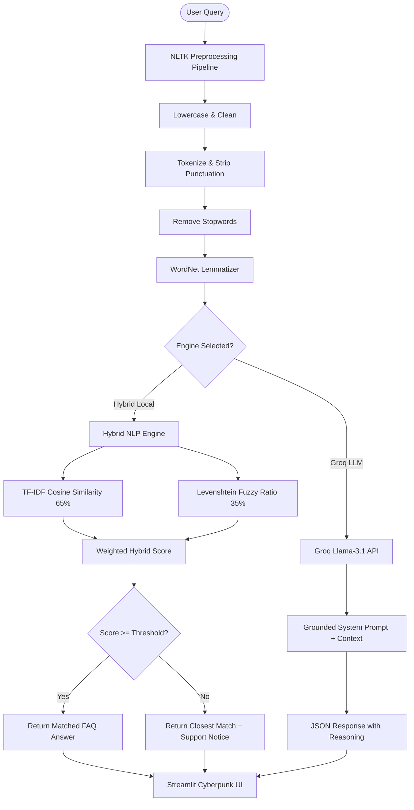

# 🤖 Aether AI FAQ Chatbot & Diagnostic Studio

[](https://www.python.org/)
[](https://streamlit.io/)
[](https://groq.com/)
[](LICENSE)
[](https://github.com/THANGASAMY-SINGARAM/chatbot/actions)

An intelligent, hybrid customer support chatbot and NLP diagnostic application built with **Python**, **NLTK**, **Scikit-Learn**, **Groq Cloud (Llama 3.1)**, and **Streamlit**.

---

## 🌟 Features

- 🧠 **Hybrid Matching Engine**: Combines **TF-IDF Cosine Similarity** (for keyword precision) with **Levenshtein Fuzzy Matching** (to handle typos and spelling errors effortlessly).
- ⚡ **Groq LLM Integration**: Leverages `llama-3.1-8b-instant` via Groq Cloud for grounded, conversational, multi-turn AI customer assistance.
- 📊 **Real-time Diagnostics Studio**:
  - Live NLTK text preprocessing pipeline trace (lowercasing, tokenization, stopword removal, WordNet lemmatization).
  - Comparative similarity score visual charts (TF-IDF vs Fuzzy vs Hybrid scores).
  - Search session metrics & query execution logging.
- ⚙️ **Interactive Knowledge Base Manager**:
  - Search, filter by category, add, edit inline, or delete FAQ entries.
  - Bulk **JSON & CSV** export/import functionality.
- 📄 **Transcript Export**: Download full chat transcripts in **JSON** or **Markdown** format with a single click.
- 🧪 **Automated Testing & CI**: Includes comprehensive `pytest` test suite and GitHub Actions workflow.

---

## 🏗 System Architecture



---

## 🚀 Quick Start

### 1. Prerequisites
- Python 3.9+ installed on your machine.
- Git installed.

### 2. Clone Repository
```bash
git clone https://github.com/THANGASAMY-SINGARAM/chatbot.git
cd chatbot
```

### 3. Create Virtual Environment & Install Dependencies
```bash
python -m venv .venv

# On Windows (PowerShell)
.\.venv\Scripts\Activate.ps1

# On Linux/macOS
source .venv/bin/activate

pip install -r requirements.txt
```

### 4. Configure Environment Variables
Copy `.env.example` to `.env` and set your optional Groq API Key:
```bash
cp .env.example .env
```
Inside `.env`:
```env
GROQ_API_KEY=your_groq_api_key_here
```

### 5. Launch Application
```bash
streamlit run app.py
```
Open your browser at `http://localhost:8501`.

---

## 🧪 Running Tests

Execute the automated `pytest` test suite:
```bash
pytest test_nlp.py -v
```

---

## 📁 Project Structure

```
chatbot/
├── .github/
│   └── workflows/
│       └── pytest.yml          # GitHub Actions CI Workflow
├── .env.example                # Environment variables template
├── .gitignore                  # Git ignore rules for virtualenv and secrets
├── app.py                      # Main Streamlit UI Application
├── faqs.json                   # FAQ Knowledge Base Dataset
├── nlp_processor.py            # Hybrid NLP & Groq Matching Engine
├── requirements.txt            # Python Dependencies
├── test_nlp.py                 # Pytest Test Suite
└── README.md                   # Project Documentation
```

---

## 🛠 Tech Stack

- **Frontend / Framework**: Streamlit
- **NLP / ML**: NLTK, Scikit-Learn (TF-IDF Vectorizer), NumPy
- **LLM Engine**: Groq Cloud SDK (`llama-3.1-8b-instant`)
- **Data Manipulation**: Pandas
- **Testing & CI**: Pytest, GitHub Actions

---

## 📜 License

This project is open-source and available under the [MIT License](LICENSE).
